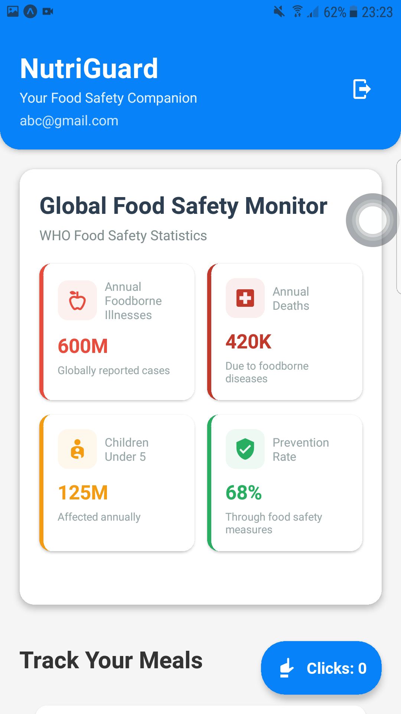

# NutriGuard

NutriGuard is a React Native mobile app focused on food safety and nutrition tracking. It helps users monitor their meals, discover healthy recipes, and access health-related information. The app features secure user authentication, a recipe dashboard, and meal tracking capabilities, all wrapped in a user-friendly interface designed to make healthy eating more accessible.


## Features

- User Authentication System (Login/Register)
- World Health stats Dashboard
- Meal Tracking Functionality
- Healthy Meals List
- Click Counter System

## Technical Implementation

- Built with React Native
- Uses Context API for state management (Auth and Click Count)
- Implements AsyncStorage for local data persistence
- Features a modern, clean UI with consistent styling
- Includes comprehensive form validation
- Uses Material Community Icons for visual elements

## Security Features

- Email/password authentication
- Password strength requirements
- Secure password storage
- Form validation with error handling

## UI/UX Elements

- Clean, blue-themed interface (#0782F9 as primary color)
- Loading states and animations
- Error handling with user feedback
- Responsive design with keyboard handling
- Custom input fields with icons
- Show/hide password functionality
## Prerequisites

- Node.js
- npm (Node Package Manager) or yarn
- React Native CLI
- Git for version control

# Mobile Development Setup

For iOS

- Xcode (latest version)
- iOS Simulator

For Android

- Android Studio
- Android SDK
- Android Emulator / Expo Go App


## Test the Project

```bash
  git clone https://github.com/PriyadasunKC/Health-App-React-Native.git
  cd Health-App-React-Native
  npm install
  npm start 
  
```
    
## Screen Shots





